# Request Flows - FinFlow API

## 1. Create User (POST /users)

## 2. Login (POST /auth/login)

## 3. Get User (GET /users/{id})

## 4. Update User (PUT /users/{id})

## 5. Delete User (DELETE /users/{id})

```mermaid
sequenceDiagram
    participant Client
    participant CORS
    participant AuthMiddleware
    participant Handler
    participant UserService
    participant Repository
    participant Database

    Client->>CORS: DELETE /users/123<br/>Header: Authorization: Bearer token
    CORS->>CORS: Add CORS headers
    CORS->>AuthMiddleware: Request
    AuthMiddleware->>AuthMiddleware: Validate JWT token
    alt Invalid token
        AuthMiddleware-->>Client: 401 Unauthorized
    else Valid token
        AuthMiddleware->>AuthMiddleware: Save userID in context
        AuthMiddleware->>Handler: Request with context
        Handler->>Handler: Extract ID from URL
        Handler->>Handler: Get userID from context
        Handler->>Handler: Verify authorization (userID == id)
        alt Not authorized
            Handler-->>Client: 403 Forbidden
        else Authorized
            Handler->>UserService: Delete(id)
            UserService->>Repository: Delete(id)
            Repository->>Database: DELETE FROM users WHERE id = ?
            alt User not found
                Database-->>Repository: 0 rows affected
                Repository-->>UserService: Error
                UserService-->>Handler: Error
                Handler-->>Client: 404 Not Found
            else User deleted
                Database-->>Repository: 1 row affected
                Repository-->>UserService: OK
                UserService-->>Handler: OK
                Handler-->>Client: 200 Success
            end
        end
    end
```

## 6. List Users (GET /users)

## 7. Sync User from Clerk (POST /users/sync)

## General Architecture Diagram

## Endpoints Summary

| Method | Route         | Authentication | Description                            |
| ------ | ------------- | -------------- | -------------------------------------- |
| POST   | `/users`      | ❌ No          | Create user (registration)             |
| POST   | `/auth/login` | ❌ No          | Login and get token                    |
| POST   | `/users/sync` | ✅ Clerk Token | Sync user from Clerk (create/retrieve) |
| GET    | `/users`      | ✅ JWT Token   | List all users                         |
| GET    | `/users/{id}` | ✅ JWT Token   | Get user by ID                         |
| PUT    | `/users/{id}` | ✅ JWT Token   | Update user                            |
| DELETE | `/users/{id}` | ✅ JWT Token   | Delete user                            |
